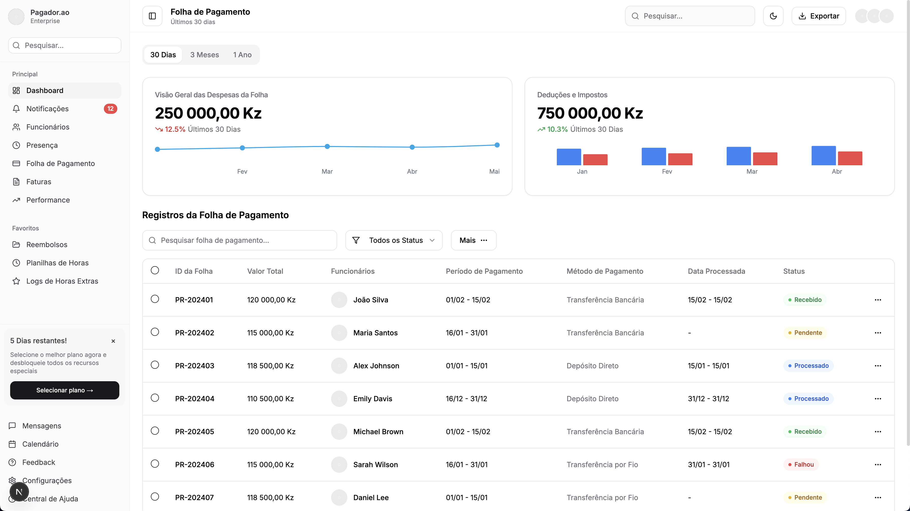
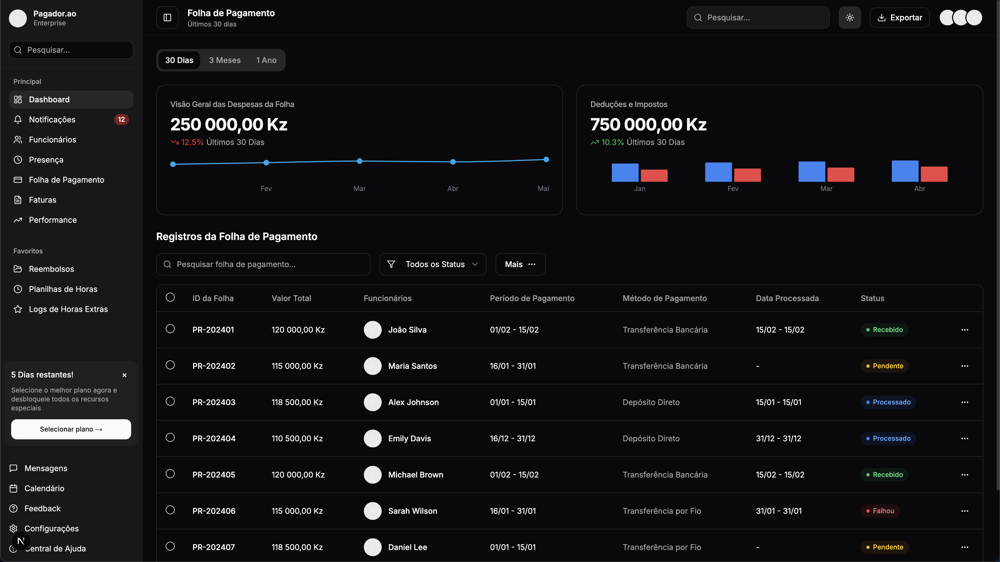

# 💸 pagador.ao

**pagador.ao** é uma plataforma premium de gestão de folha de pagamento e RH, desenvolvida para simplificar e automatizar o processamento salarial de empresas angolanas. Construído com foco em experiência do usuário, responsividade e performance, o sistema segue os princípios do [Apple Human Interface Guidelines (HIG)](https://developer.apple.com/design/human-interface-guidelines/), suportando tanto modo claro quanto escuro.

## 🖼️ Preview

### Light Mode



### Dark Mode



---

## 🚀 Funcionalidades

- 📊 **Dashboard Gerencial** com gráficos e indicadores de despesas salariais
- 🧑‍💼 **Gestão de Funcionários**
- 🗓️ **Calendário de Pagamentos e Presenças**
- 💼 **Controle de Períodos e Métodos de Pagamento**
- 💬 **Central de Mensagens e Notificações**
- 📋 **Formulários Dinâmicos e Validáveis**
- 📈 **Relatórios e Exportações de Dados**
- 🌗 **Modo Claro e Escuro**
- 📱 **Design Responsivo** para desktop, tablet e mobile

---

## 🧑‍💻 Tecnologias Utilizadas

- **React + Vite**
- **Tailwind CSS**
- **Lucide Icons**
- **React Query / Zustand (para gerenciamento de estado)**
- **Chart.js ou Recharts (para gráficos)**
- **i18n com suporte para português (pt-BR)**

---

## 📦 Estrutura do Projeto

```
pagador.ao/
├── app/
├── components/
├── hooks/
├── lib/
├── public/
│   └── screenshots/
└── styles/
└── README.md
```

---

## 📌 Como executar o projeto

```bash
# Instale as dependências
pnpm install

# Rode o projeto em modo de desenvolvimento
pnpm run dev

# Build para produção
pnpm run build
```

---

## 🌍 Idioma

Toda a interface do sistema está em **português (pt-BR/AO)**, focando na acessibilidade e compreensão para empresas e colaboradores locais.

---

## 📬 Contato

Caso tenha sugestões, feedback ou queira contribuir, entre em contato comigo pelas redes sociais:

- 🌐 [Facebook](https://www.facebook.com/ikitumba)
- 📸 [Instagram](https://www.instagram.com/albertokitumba/)
- 🐦 [Twitter (X)](https://x.com/TheKitumba)
- 💼 [LinkedIn](https://www.linkedin.com/in/albertokitumba/)

---

**pagador.ao** — Feito com ❤️ para empresas que valorizam eficiência e transparência.
